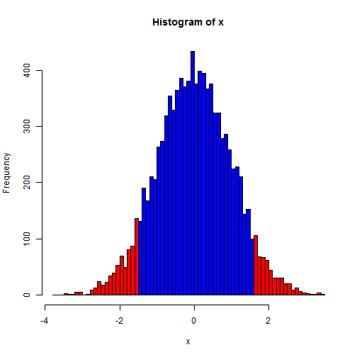

## Background, Purpose & How To Run

### Background

This application was developed as course project for the Coursera class "Developing Data Products" from ... It is my first shiny app and so the functionality is small but in my opinion nice and adequate to learn the basic idea behind shiny.

### Purpose

The main purpose of this application is to get familiar with the concepts of shiny. So the **user** has very limited possibility to interact with the app while the **developer** has learned a lot building it :-)

### How To Run

Placing **ui.R** and **server.R** in one directory, you can run the application in **RStudio** via the **runApp()** command.

--- .class #id 

## How To Use

The user of this application can make some choices in the **sidebar panel** on the left to influence the structure and layout of a histogram chart in the **main panel**.

This histogram is based on a random set of 10000 values in Gauss distribution (rnorm). It is randomly generated when the user launches the app and shows the characteristical bell curve.

The following three main factors can be influenced through user input in the **sidebar panel**:

1. Headlines of the histogram: here the user can choose between title, sub title, author and date. These headlines are independantly shown on top of the histogram.
2. Number of breaks in the histogram: to keep it simple, the application offers a slider to choose between four standard values: 10, 50, 90, or 130 breaks.
3. The threshold to color the tails of the bell curve: while the histogram is colored blue, the user can influence the size of the tails colored in red.

In addition to the adaption of the plot, the application also shows the numerical input values for breaks and thresholds in the **main panel** below the histogram.

--- .class #id 

## The Algorithm


```r
x <- rnorm(10000); breaks <- 90; threshold <- 1.6
hx <- hist(x, breaks, plot=FALSE); plot(hx, col=ifelse(abs(hx$breaks) < threshold, 4, 2))
```

 

--- &radio

## What Do You Think?

After reading through my first slidify deck on my first shiny app, I'm curious to see, if you can imaging, what I think about all these. So please answer the following question:

How do I like my first shiny app?

1. _the best shiny app and slidify deck I've ever done_
2. okay, but nothing special
3. don't like it at all

*** .hint 
Come on, it's not as difficult as you might think.

*** .explanation 
As it's my first experience, it also must be my best :)


